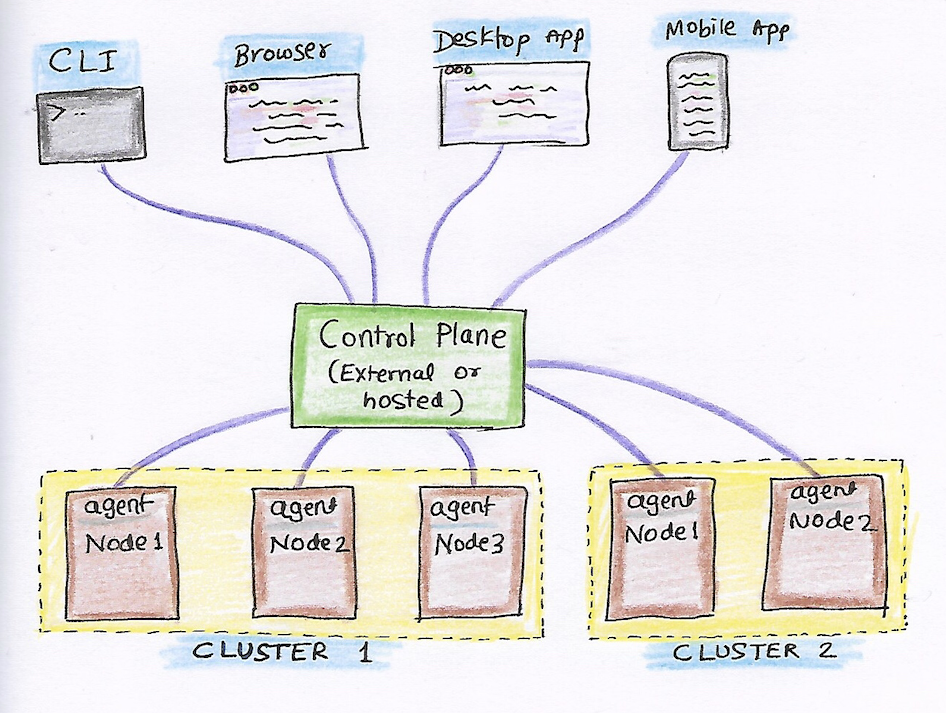
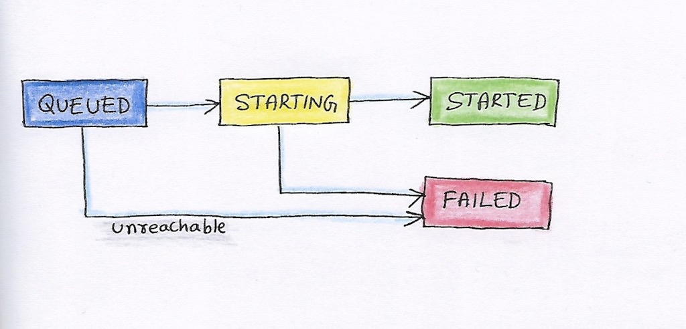

- Start Date: 2020-02-17
- Tracking:
- RFC PR: [kadalu/rfcs#0014](https://github.com/kadalu/rfcs/pull/14)
- Status: PROPOSED

# External Control Plane for GlusterFS

## Summary

Glusterd is the default management daemon used for managing Gluster
Filesystem. It is responsible for maintaining the meta details and
health of the Cluster, Volumes, and other resources. When the number
of nodes increases per Cluster, then it becomes complicated to
maintain every resource in sync and ends up in too many connections
between nodes. For example, if a Cluster has 50 nodes, on any state
change, it will be updated in all the 50 nodes.  The new design will
not use Glusterd, instead delegates the GlusterFS management
responsibilities to an external ReST server.

## Authors

- Aravinda Vishwanathapura \<aravinda@kadalu.io\>
- Amar Tumballi \<amar@kadalu.io\>

## Motivation

Advantages compared to Glusterd design are,

- Multi cluster support - Manage multiple clusters using a single
  Control Server.
- ReST APIs - Easily integrate with external applications or mobile
  apps.
- Multi-platform support - Manage Gluster Cluster easily from Linux,
  Windows, Mac, or even from Mobile.
- Scale - Easily scale Cluster with many nodes since no overhead of
  syncing each Cluster state change to nodes.
- Easily migrate the Control server to other nodes when required.

## Detailed design

The control plane maintains all the states related to users, clusters,
volumes, and others. CLI or web UI will request a Control plane to
create/modify the resources. For example, CLI will send a request to
create Volume to Control plane and control plane converts as brick
create and start request for respective node agent. The node agent
will pick up the request and acknowledges it once complete.

The control plane never connects to nodes, so no access to the node
agent is required. All communications to a node should be done via a
message queue. Each node agent will maintain a heartbeat and updates
the information to the Control plane in periodic intervals.



### Control plane

The main server where all states will be stored and provides APIs
required for managing the Gluster filesystem. The primary
responsibility of the Control plane includes routing the messages to
respective nodes and listen to the response from the nodes. For
example, for Volume start request, send message to all participating
nodes and wait for the update from the node as brick started.

Responsibilities of Control plane are,

- Routing messages to respective nodes.
- Get the acknowledgment and update the states
- Update the status once the node agent reports the task done.
- Provide state of Volumes, Cluster, etc
- Generate alerts based on the Health of Cluster
- Multi cluster support
- Authentication

### Web/Mobile/Desktop app:
Web/Mobile UI, which consumes the APIs and provides a rich interface
for Gluster management.

### CLI
CLI is also a ReST client, which interacts with the Control server to
manage the Gluster Cluster(s).

### Node agent:
Node agent will be installed in all the nodes and communicates with
the control plane for all actions. Maintains a heartbeat with the
control plane and exports the status.

- Listen to messages from the Control plane and execute.
- Acknowledge and update the progress.

At the start of the node agent, it connects with the Control plane and
keeps a persistent connection. The control plane will maintain the
task queue for each node, each node agent will subscribe to its task
queue and perform the action. Unlike Glusterd, all tasks are executed
asynchronously from the node agent and acknowledged to Control
Server. For example, to start a brick process, the Control plane puts
a message as "START_BRICK" with status "QUEUED", Node agents pick the
task and updates the status as "STARTING" and then it starts the Brick
process. Once the Brick process starts successfully, the node agent
updates the state as "STARTED". In case of failure, the node agent
will update the state as "FAILED" and the reason for failure. If the
node agent is unable to connect to Control Plane or node is down, then
the task state will remain as "QUEUED" and node state will be changed
to "UNREACHABLE".



### Communication between Control Server and Node agent:

The control server will not have access to node agents; Node agents
will connect to the Control server and gets the details. Node agents
can establish a WebSocket connection so that the Control server can
push the notification when needed.


## Monitoring and Dashboard

The dashboard of the Control plane shows the real-time status of the
cluster. Visualizing historical data is possible by using Prometheus
or other similar solutions.

The control plane will have up to date details about the health of the
cluster, Volume utilization, and other metrics. The control plane will
not store the historical data, and Prometheus can be used for
visualizing historical data.

Control plane can become Prometheus exporter by exposing a new API
`/metrics`. Prometheus server running in the same node as the control
plane can pick up the metrics from the control plane. Use the Grafana
dashboard to visualize the metrics from Prometheus. (Note: Grafana
dashboards can be embedded into any website, may be embedded in the
WebUI of control plane)

## Backup and Recovery of Cluster metadata

Every change to Cluster meta information will be versioned. On a
handshake, each node agent downloads the cluster meta information and
saves it locally. If the control server node goes down, then it can be
started in some other node by restoring data from any node agent(Or
choose the node agent which contains the latest cluster data).

## High availability of Control plane

Control Server is no different from a web server, use all the
available scaling and load balancing techniques for hosting it. Use
the "Streaming Replication" feature of Postgresql for disaster
recovery.

More on this topic TBD. High availability of the database is also
possible by using the Gluster Volume as storage for the
database. (This is based on the fact that Replica 3 Gluster volume can
be run as service without the need of Glusterd)

## Usage:

CLI commands used in the following examples. CLI is one of the
mechanisms to control the Cluster.  Other ways to communicate with the
Control plane are Web UI, ReST APIs, etc.

### User management

In the case of the self-hosted Control server, the first user will
become the Admin user. Create more users using admin privileges.

Granular user permissions that enable them to access specific
resources on the Cluster, such as Volumes, Nodes, and Storage
devices.

Log in to the Control server by running the following command, and the
token will be saved in `~/.gluster/token.json` on a successful login.

All consecutive commands will use the token saved in the file
mentioned above. To logout, run the following command.

```
$ kadalu login
Username:
Password:
Logged in successfully. The token is saved to ~/.kadalu/token.json
```

If the Gluster control plane is self-managed, then use the `--url`
parameter.

```
$ kadalu login --url https://node1.example.com:8080
```

All consecutive commands will use the token saved in the file
mentioned above. To logout, run the following command.

```
$ kadalu logout
Logged out successfully
```

### Create Cluster and nodes registration

Cluster registration is Optional. The default cluster will be created
with the name `default`. Registering Cluster provides logical
namespace to differentiate the volumes. For example, one Cluster can
be `mycluster`, and another one can be `backup_cluster`.

```
$ kadalu cluster add mycluster
Cluster creation request sent.
```

After registering a Cluster(or for the default Cluster), the Control
server will generate a token. Set the token as an environment
variable(Other ways to set Token TBD) in each storage node and start
the Node agent. The node agent will register itself with the Control
server by identifying it with the token.

Once the node agent registers with the Control Server, it establishes
a persistent connection(Or polling) to listen to the events from the
Control server.

### Cluster Status

Cluster status can be checked using,

```
$ kadalu cluster status
```

Cluster status will show the state of each node. If a node connects to
the control server, then it shows that node is Online, else it shows
Unreachable.

### Device Management

Register the Storage devices using the following command.

```
$ kadalu device add -c mycluster node1.example.com --device /dev/vdc
```

or

```
$ kadalu device add -c mycluster node1.example.com --path /exports/bricks/b1
```

Multiple device or path can be specified for a node.

The storage device is not yet part of any Volume but helps to design
utilities like dynamic Volume provisioning like below command.

```
$ kadalu volume create -c mycluster gvol1 --replica3 --size 100GiB
```

### Volume Create

Run the following command to create the Volume.

```
$ kadalu volume create -c mycluster gvol1  \
      node1.example.com:/exports/storage1
Volume creation request sent.
```

The volume will start automatically once created. Use `--no-start` if
only Create is required.

### Volume Start

```
$ kadalu volume start -c mycluster gvol1
Volume start request sent.
```

### Volume Stop

```
$ kadalu volume stop -c mycluster gvol1
Volume stop request sent.
```

### Volume Delete

```
$ kadalu volume delete -c mycluster gvol1
Volume delete request sent.
```

### Status

```
$ kadalu volume status -c mycluster gvol1
```

The controller waits for node agents to acknowledge the status, so the
intermediate state introduced for every action. For example, “Volume
Creating”, “Volume Created” and “Volume Create Failed”

**Status**: Creating, Created, CreateFailed, Starting, Started,
StartFailed, Stopping, Stopped, StopFailed, Deleting, DeleteFailed

**Note**: Export failure reason also from Node agents. If the node is
down then, Status can show the same("Unreachable")

### Failure report!

The following command shows the last failure details.

```
$ kadalu failurereport
Volume creation failed in the following nodes.

node1.example.com - Failed due to ENOENT.

Reason: ENOENT failures are mainly due to root directory is not
present for which brick directory is specified. For example, if brick
on this node specified as `/exports/storage1`, then `/exports`
directory is not present in that node.

How to fix:

Log in to the node and create the root directory.
```

### Volume Options

```
$ kadalu volume set -c mycluster gvol1 <optname> <optvalue>
$ kadalu volume reset -c mycluster gvol1 <optname>
$ kadalu volume get -c mycluster gvol1 [<optname>]
```

Control Server will validate Volume Options. The changed option will
be picked by the Node agent to regenerate the brick, self-heal volfile
when necessary. It also notifies the running daemon to reload to get
the reconfigured volfile content.

If only client option changes, then the wrapper script, which started
the mount/client, will pick up the latest configuration and reloads
the client process.

### Volume expand

Start the node agent(Set env variable or config file to point to
Control plane) and then run the following command to expand Volume.

```
$ kadalu volume expand -c mycluster gvol1
       node4.example.com:/export/storage2
```

**Note**: Connected clients will get notification about Graph change.


### Rebalance

Start rebalance process using,

```
$ kadalu volume rebalance start -c mycluster gvol1
```

Other commands available are, `stop`, `status`

### Volume Shrink

Not for Version 1. TBD(Remove brick, Rebalance etc)

### Geo-replication

Preparing the remote nodes for accepting ssh connections from master
nodes is required(A separate tool will be provided for the same).

### Create Geo-replication session using,

```
$ kadalu geo-replication create -c mycluster \
    --remote-user geouser --remote-cluster mycluster2 \
    mastervol remotevol
Geo-replication session creation request sent.
ID: 068EB4E3-7E00-4CB5-899A-4C522AEC0F98
```

The geo-rep session will start automatically after create. To avoid
this, `--no-start` can be used.

Start Geo-replication session using,

```
$ kadalu geo-replication start <ID> -c mycluster
Geo-replication start request sent.
```

Similarly, other commands available are: stop, delete, config-get,
config-set, config-reset, and status.

**Bonus**: The control plane itself can decide Active/Passive worker
per subvolume.

## Snapshot

TBD. Two possible approaches available are,

- Special sexattr on the mount can trigger snapshots in all bricks.
- Similar to the existing method, Control Server can notify all mounts
  to enable barrier and notify node agents to take backend snapshot.

## Quota management

TBD.
